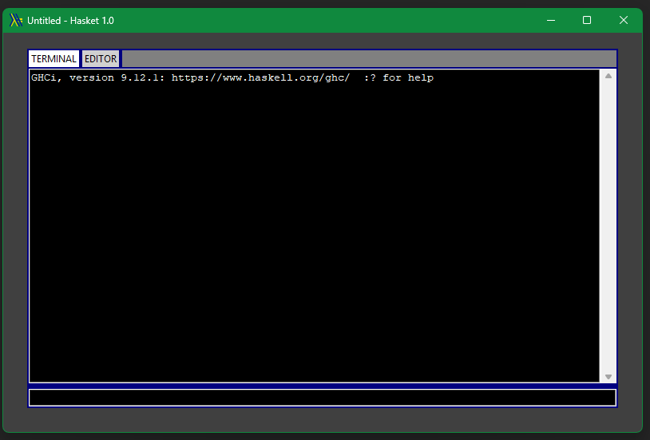
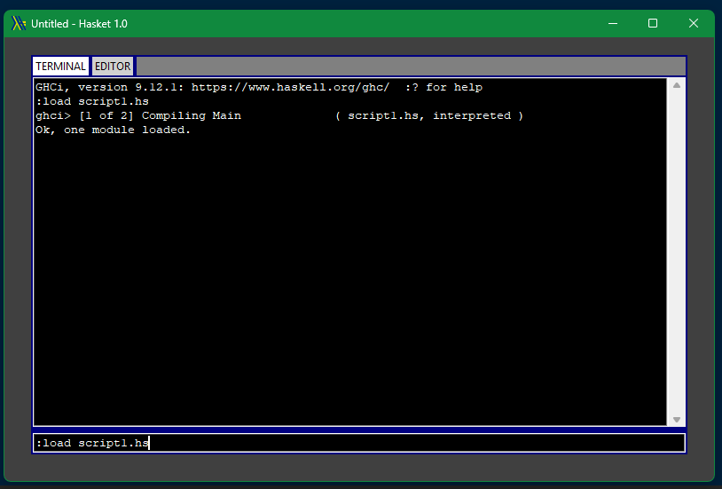

# Hasket Version 1.1 (Release for Python 3.10+)

Hasket is a python based program that is designed to create a lightweight shell in for streamlined writing of Haskell
code.

The code contains options for extending Hasket functionality to include custom panels and designs for customisation and
extensions of practicality.

<b>A working version of python (at least 3.10) must be present to use this system.</b>

<b>Please note GHCI must already be present on the client system to use Hasket. </b>

## Features

### The terminal Window

The terminal is the main way to interact with GHCI. You can enter any haskell command in the entry bar at the bottom of
the window, press enter, and the command will run.

The terminal also has additional commands implemented in Hasket:

***

- `\loadEditor` - If a program has been saved in the editor, then this command will load the script as if imported.
- `\restart` - Will attempt to restart GHCI if things have gone awry.
- `\clear` - Will clear the terminal output window.
- `\load <scriptPath>` - Will attempt to load the script provided

***

### Editor Commands

- `Ctrl-s` Save script
- `Ctrl-Shift-s` Save As script
- `Ctrl-o` Open script
- `Ctrl-n` New script

***

## Style Guides for future additions

This project will generally conform to established <a href="https://peps.python.org/pep-0008/">PEP-8</a> style guides
for python with a few notable exceptions:

- Class methods and members shall conform to `mixedCase` convention. This is because
  I like this standard and arguably this is my project.

- Line length shall be no more than 100 characters. This is to ensure that logic is not overly complicated per line
  but to relieve cases where 79 characters is just restrictive.
- Closing parenthesis does not need to go on a separate line.

Variable names inside of functions do not have to follow any specific naming conventions.

***

<i>Note: Inheritance is a key part of including additional window tabs in Hasket.
If a new tab is created, please implement all base methods. To practice public and non-public standards,
any mangled names are to be kept mangled. Please do not go into the parent class, I will reject your merge request!</i>