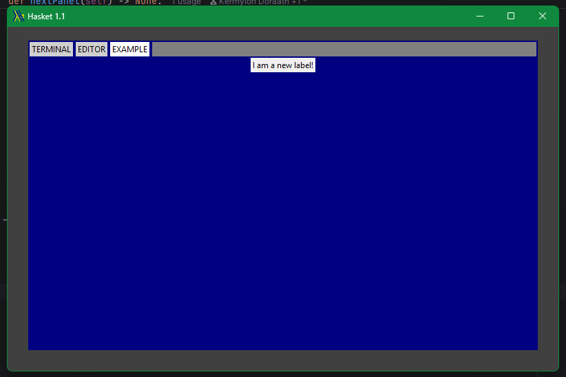

## Creating Hasket Panels

At the most toplevel view, creating a Hasket panel is simple.

You will need to import the Generic Panel class from hasketCore, and it is
recommended you also import `tkinter`, but that is not as necessary for 
panel creation.

```python
from hasketCore.GenericPanel import GenericPanel
```
That gives you a set of panel attributes. The recommended way to create
a Hasket panel is to create a derived class. Said derived class would need to
implement the following methods:

```python
class SamplePanel(GenericPanel):
    def __init__(self, master: Widget):
        super().__init__(master)
        pass

    def loadPanel(self):
        pass

    def unloadPanel(self):
        pass
```

This will create a panel that can load into Hasket. On its own, this is not 
particularly useful. But, this can be extended with further code. More 
specifically, if you use `tkinter` library:

```python
from tkinter import Label

class SamplePanel(GenericPanel):
    def __init__(self, master):
        super().__init__(master)

        self.handyLabel = Label(master, text="I am a new label!")

    def loadPanel(self):
        self.handyLabel.pack(anchor="center")

    def unloadPanel(self):
        self.handyLabel.pack_forget()
```

Then you can create a fancy label. 

It is important that the label is created inside the __init__ method, but <u><b>is
not rendered.</b></u> This is because the rendering must only happen on a call to 
draw  the selected panel via `GenericPanel.loadPanel`. Then when a new panel is 
drawn, the label must also be dismissed from the render manager via a subsequent
call to `GenericPanel.unloadPanel`

Finally, we must add the new panel to the roster of panels. I will use `haskey.py`
as an example.

```python
if __name__ == "__main__":
    mWindow = HasketWindow()

    #Adding a new panel.
    mWindow.createPanel("EXAMPLE", SamplePanel)

    mWindow.start()
```

And just like that, the panel is loaded:



You may also notice that when I called `createPanel`, I gave it the name
"EXAMPLE". This is a unique identifier to tell Hasket what panel this is.
Now whenever we `Control-Tab` across, we can select this panel.

___

<b>Note: Panel names must be unique! If they are not, tabbing to a new tab
will yield unintended behaviour, so please take care naming them!</b>

Your identifier can be just about anything, but it must not be:

- TERMINAL
- EDITOR

As these are Hasket internals.